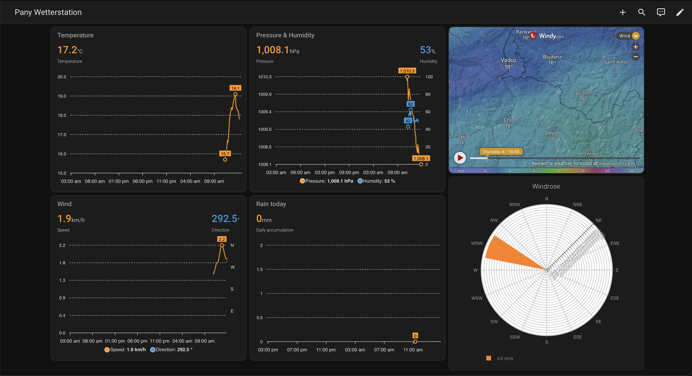

[](https://github.com/sebastianzillessen/home-assistant-weewx-scrape/actions/workflows/release.yml)

# WeeWX Seasons (scrape) — Home Assistant integration

A Home Assistant custom integration that reads **current weather conditions
from any [WeeWX](https://weewx.com/) website using the standard "Seasons"
skin** and exposes them as Home Assistant sensors.

WeeWX publishes a static `index.html` and does not expose a JSON/realtime API by
default, so this integration scrapes the current-conditions table from that
page. It works with any Seasons-skin station — the example used throughout this
README is **[pany.gr](https://pany.gr/)** (Wetterstation im Prättigau,
Pany/Luzein, Switzerland, a Davis Vantage Pro2).

## Sensors

For each configured station the integration creates one device with these
entities:

| Sensor | Device class | Unit | Notes |
| --- | --- | --- | --- |
| Outdoor temperature | temperature | °C | |
| Humidity | humidity | % | |
| Pressure | atmospheric pressure | hPa | `trend` attribute (e.g. `-1.0`) |
| Pressure trend | – | hPa | the parenthesised change, as a number (e.g. `-1.0`) |
| Wind speed | wind speed | m/s | `direction` attribute (e.g. `WNW`) |
| Wind bearing | – | ° | wind direction in degrees (0–360), derived from the cardinal direction |
| Rain today | precipitation | mm | `state_class: total_increasing` |
| Station reading time | timestamp | – | the station's own "data as of" time |

**Wind bearing** and **Pressure trend** are numeric counterparts to the
`direction`/`trend` attributes, so cards that need a plottable number (a wind
direction axis, a windrose, a trend graph) can use them directly. Wind bearing
maps the station's cardinal abbreviation (English `WNW` or German `WNW`/`NNO`/…)
to degrees; it is unavailable when the wind is calm and no direction is shown.

The **Station reading time** sensor exposes the timestamp printed on the page
(its `lastupdate` line) as a proper `timestamp` entity, so dashboards can show
how old the data is ("5 minutes ago"). The Seasons page prints this time
without a timezone, so the integration applies the **Station time zone** chosen
during setup (see Configuration). If the page carries no parseable timestamp,
the sensor is unavailable.

> The Seasons skin is rendered in the station owner's language. German and
> English labels are recognised out of the box. To add another language, extend
> `SENSOR_ALIASES` in
> [`custom_components/weewx_scrape/parser.py`](custom_components/weewx_scrape/parser.py).

## Installation

### HACS (recommended)

1. In HACS, open the three-dot menu → **Custom repositories**.
2. Add `https://github.com/sebastianzillessen/home-assistant-weewx-scrape`
   with category **Integration**.
3. Install **WeeWX Seasons (scrape)** and restart Home Assistant.

### Manual

1. Copy the `custom_components/weewx_scrape` folder into your Home Assistant
   `config/custom_components/` directory.
2. Restart Home Assistant.

## Configuration

This integration is configured entirely through the UI — no YAML required.

1. Go to **Settings → Devices & Services → Add Integration**.
2. Search for **WeeWX Seasons (scrape)**.
3. Fill in:
   - **Name** – a label for the station device (e.g. `Pany`).
   - **Station URL** – the station website, e.g. `https://pany.gr/`. A bare
     host or a path ending in `/` automatically resolves to `index.html`.
   - **Update interval** – `5`, `10`, `15` or `60` minutes (default `10`).
     Match this to your station's archive interval; most stations update every
     5–10 minutes, so polling faster gains nothing.
   - **Station time zone** – IANA name (e.g. `Europe/Zurich`) applied to the
     station's reading time, which the Seasons page prints without a timezone.
     Defaults to Home Assistant's own timezone; change it only if the station
     is in a different zone.

The interval and time zone can be changed later via the integration's
**Configure** button.

## Dashboard

The integration ships a ready-made weather dashboard with charts for
temperature, wind (speed + direction), pressure & humidity, daily rain, an
optional Windy.com map and a windrose — modelled on
[this community dashboard](https://gist.github.com/idcrook/51f27869a4ba4cd78d5cf2be8babe70e).
There are two ways to use it.



Both need a couple of custom chart cards. In **HACS → Frontend**, install and
then reload your browser:

- [`apexcharts-card`](https://github.com/RomRider/apexcharts-card) — the charts
- [`plotly-graph-card`](https://github.com/dbuezas/lovelace-plotly-graph-card) — the windrose (`custom:plotly-graph`)

HACS cannot install dashboards themselves (there is no such category), so the
dashboard is delivered the two ways below instead.

### Option A — dashboard strategy (recommended)

The integration registers a **dashboard strategy** with the frontend
automatically (no extra HACS plugin or Lovelace resource needed). It discovers
your station entities and builds the whole dashboard for you — no entity IDs to
edit.

1. **Settings → Dashboards → Add dashboard → New dashboard from scratch.**
2. Open it, then **Edit → ⋮ → Raw configuration editor** and replace the
   contents with:

   ```yaml
   strategy:
     type: custom:weewx-seasons
     # all optional:
     windrose: true        # default true
     windy:                # omit to hide the Windy.com map
       lat: 46.95
       lon: 9.78
   ```

It creates one view per configured station and adapts automatically when you
add or remove stations. If a new dashboard shows "no station entities", reload
your browser (the strategy module is cached) and confirm the integration is set
up.

### Option B — copy the YAML (full control)

Prefer to tweak the layout yourself? [`dashboard.yaml`](dashboard.yaml) contains
the same dashboard as a plain view (it additionally uses
[`layout-card`](https://github.com/thomasloven/lovelace-layout-card) for a fixed
grid). Open your dashboard's **Raw configuration editor**, paste it into the
`views:` list, then:

- Replace every `pany` in the entity IDs with your own station's slug — the
  device name you chose during setup, lower-cased with spaces replaced by
  underscores (e.g. a station named `Pany` → `sensor.pany_outdoor_temperature`).
  The exact IDs are listed under **Settings → Devices & Services → WeeWX
  Seasons (scrape)** on the device page.
- Set the Windy iframe's `lat`/`lon` to your station's coordinates.

> **Note:** the source dashboard expects ~14 sensors (feels-like, dew point,
> wind gust, solar/UV, rain *rate*, …). This integration scrapes only the
> values the Seasons current-conditions widget shows, so those extra panels are
> omitted. Wind speed and its windrose buckets are in **m/s** (this
> integration's unit), not MPH. The wind-direction axis and windrose use the
> `Wind bearing` sensor, which the integration provides directly.

## How it works

On each update the integration fetches the station's `index.html`, isolates the
`current_widget` table and reads the `label`/`data` cell pairs, mapping known
labels (German/English) to the sensors above. If the page cannot be fetched or
the `current_widget` table is missing (station offline or an unsupported page),
the sensors become unavailable until the next successful poll.

## Troubleshooting

- **"Could not connect…" during setup** – confirm the URL opens in a browser
  and shows the current-conditions box. Use the page that contains the
  "Aktuell"/"Current" widget (usually the site root / `index.html`).
- **Sensors unavailable** – the station may be temporarily offline, or its page
  uses a non-Seasons skin or a translated label that isn't mapped yet. Enable
  debug logging:
  ```yaml
  logger:
    logs:
      custom_components.weewx_scrape: debug
  ```

## No-code alternative (built-in `scrape`)

If you prefer not to install a custom integration, Home Assistant's built-in
[`scrape`](https://www.home-assistant.io/integrations/scrape/) platform can read
a single value per sensor with a CSS selector, e.g.:

```yaml
sensor:
  - platform: scrape
    resource: https://pany.gr/index.html
    name: Pany outdoor temperature
    select: "#current_widget tr:nth-of-type(1) td.data"
    unit_of_measurement: "°C"
    value_template: "{{ value | regex_findall_index('-?\\d+(\\.\\d+)?') }}"
    scan_interval: 600
```

This integration is more convenient: one request feeds all sensors, it is
language-aware, and it is configured through the UI.

## Development

The HTML parsing logic lives in `parser.py` and has **no Home Assistant
dependency**, so it can be tested standalone:

```bash
pip install pytest
pytest tests -q
```

## Disclaimer

This project is not affiliated with WeeWX or with any weather station it reads.
It only performs read-only HTTP requests against a public website. Be a good
citizen and keep the update interval reasonable.

## License

[MIT](LICENSE)
